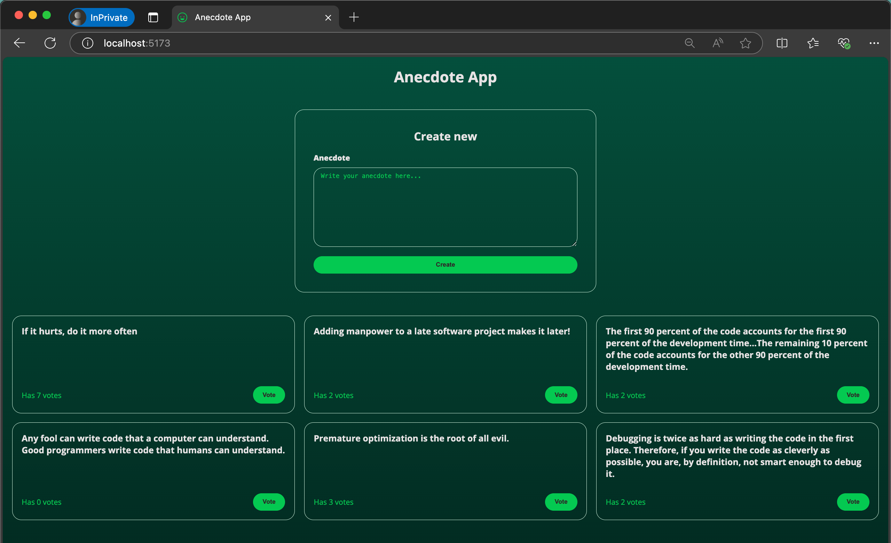

# Query Anecdotes App

The Anecdote App is a web application built with **React** and **TanStack React Query** for managing server state. It allows users to view, vote, and create anecdotes. The app uses a **JSON Server** as a mock backend to handle CRUD operations and includes a notification system to provide feedback to users.

## Features

- **View Anecdotes**: Fetch and display a list of anecdotes from the server.
- **Vote for Anecdotes**: Users can vote for their favorite anecdotes, and the vote count is updated in real-time.
- **Create Anecdotes**: Users can submit new anecdotes, which are validated on the server to ensure they meet the minimum length requirement.
- **Notifications**: A notification system provides feedback for successful votes, new anecdote submissions, and errors.

## Technologies Used

- **React**: A JavaScript library for building user interfaces.
- **TanStack React Query**: A data-fetching library for managing server state, caching, and synchronization.
- **Axios**: A promise-based HTTP client for making requests to the server.
- **JSON Server**: A mock REST API for simulating a backend server.
- **Vite**: A fast build tool for modern web development.
- **CSS**: Custom styles for the application.

## Getting Started

### Prerequisites

- Node.js (v16 or higher)
- npm or yarn

### Installation

1. Clone the repository:

   ```bash
   git clone https://github.com/josemigueli/fso-part6.git
   cd fso-part6/query-anecdotes
   ```

2. Install dependencies:

   ```bash
   npm install
   ```

3. Start the JSON Server:

   ```bash
   npm run server
   ```

   This will start the mock backend server on `http://localhost:3001`.

4. Start the development server:

   ```bash
   npm run dev
   ```

   The app will be available at `http://localhost:5173`.

5. (Optional) Build the app for production:

   ```bash
   npm run build
   ```

6. (Optional) Preview the production build:
   ```bash
   npm run preview
   ```

## Usage

- **View Anecdotes**: The homepage displays a list of anecdotes fetched from the server.
- **Vote for Anecdotes**: Click the "Vote" button next to an anecdote to increase its vote count.
- **Create Anecdotes**: Use the form at the top of the page to submit a new anecdote. The anecdote must be at least 5 characters long.
- **Notifications**: Notifications will appear at the top of the page for successful votes, new submissions, or errors.

## Dependencies

- **React**: `^18.2.0`
- **TanStack React Query**: `^5.45.1`
- **Axios**: `^1.7.2`
- **JSON Server**: `^0.17.4`
- **Vite**: `^4.4.5`

## Scripts

- **`npm run dev`**: Start the development server.
- **`npm run build`**: Build the app for production.
- **`npm run preview`**: Preview the production build.
- **`npm run server`**: Start the JSON Server.
- **`npm run lint`**: Run ESLint to check for code issues.

## Gallery

### Home View



## License

This project is open-source and available under the MIT License.
